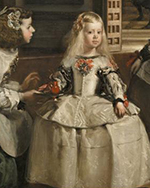

# DOCUMENTACIÓN
## HTML
En primer lugar, el html cree tres secciones y un header en la cabecera está colocado “Los cuadros de Velázquez” en la primera sección hay unas miniaturas de los cuadros de Velázquez donde hay una barra de scroll para navegar entre ellos, en la segunda sección aparece el cuadro en grande y en la ultima aparecen datos sobre el cuadro y un botón de compra.
Como no conseguí insertar código de JavaScript hay una página para cada cuadro y otra para cada cuadro en grande, hay un enlace al hacer click en las imágenes grandes se abrirá en otra ventana con un fondo negro.

## Seccion de imagenes de la parte izquierda

<section class="menu-izquierda">

        

            
        

        

            
        

        

            
        

        

            
        

        

            
        

    </section>

## CSS
En el css di el estilo para las distintas secciones aportando los tamaños, estilo de letra y el formato de las imágenes, aunque no he conseguido que el resultado sea el óptimo que se pedía ya que al modificar el tamaño de la ventana el formato se “rompe”.

## CSS de las miniaturas de la izquierda 

.menu-izquierda{
    width: 200px;
    height: 550px;
    line-height: 75px;
    overflow: scroll;
    position: fixed;

}

.imagen{
    height: 188px;
    width: 150px;
    filter: grayscale(1);
}

.imagen-actual{
    height: 188px;
    width: 150px;
}

.imagen:hover{
    filter: grayscale(0);
    transition-duration: 1s;
}
